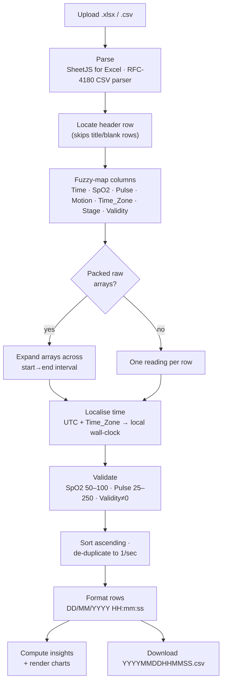
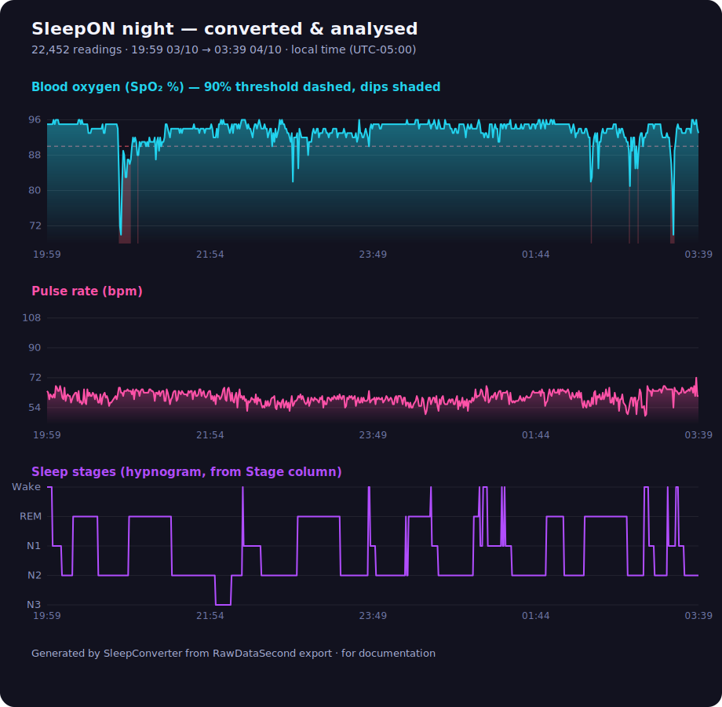

# SleepON → SleepHQ: Data Formats & Conversion, in Detail

This document captures everything learned about the **SleepON / Go2Sleep** export
format and the **SleepHQ / Wellue O2 Ring** import format, and exactly how
`SleepConverter.html` bridges the two. It is written from a **real export**
pulled directly from the SleepON cloud (`https://sleepon-cloud.sleepon.us`),
cross-checked against the Wellue/Viatom CSV layout that SleepHQ and OSCAR ingest.

---

## 1. The input: SleepON cloud "RawDataSecond" export

When you export from the SleepON cloud you get an **`.xlsx`** workbook named like:

```
RawDataSecond_UserId_3709_20260608140353_RSlnq08q.xlsx
```

- The single worksheet is named after the recording's **UTC start date** (e.g. `2025-10-04`).
- Row 1 is the header; every subsequent row is **one sub-second sample** (~1 Hz, with `.000`/`.999` millisecond pairs, so roughly two rows per second).
- A typical night is **20,000–28,000 rows**.

### Columns (10)

| # | Header | Example | Type | Meaning / notes |
|---|--------|---------|------|-----------------|
| 0 | `User_ID` | `3709` | string | SleepON account id. Metadata. |
| 1 | `Device` | `Go2Sleep 0470` | string | Model + short id. Metadata. |
| 2 | `SN` | `15201BAL25030470` | string | Device serial number. Metadata. |
| 3 | `Time` | `2025-10-04T00:59:04.000Z` | **ISO‑8601 UTC** | **Absolute instant in UTC** (note the trailing `Z`). Milliseconds present. |
| 4 | `Time_Zone` | `-05:00` | string offset | The recording's local UTC offset. **You must apply this to `Time`.** |
| 5 | `Heart_Rate(BPM)` | `64` | number | Pulse, beats/min. |
| 6 | `Oxygen(%)` | `96` | number | SpO₂, percent. |
| 7 | `Active` | `0` … `130` | number | Body **motion**/activity level. 0 = still. |
| 8 | `Stage` | `Wake` / `N1` / `N2` / `N3` / `REM` | string | Sleep stage (hypnogram). |
| 9 | `Validity` | `1` | number | 1 = valid sample, 0 = drop. |

### ⚠️ The single most important insight: `Time` is UTC, local time lives in `Time_Zone`

`Time` is **not** local wall-clock time — it is the absolute instant in UTC.
The actual time the person was asleep is `Time + Time_Zone`:

```
UTC      2025-10-04T00:59:04Z
offset   -05:00
local  = 2025-10-03 19:59:04      ← what SleepHQ must see
```

> The previous version of this tool ignored the offset and wrote the UTC
> wall-clock straight out. Result: every timestamp was **5 hours off and on
> the wrong calendar day**, so SleepHQ could never line the O₂ data up with the
> CPAP session. Spreadsheet apps make this worse — opening the `.xlsx` and
> re-reading the `Time` column renders it in *your* computer's timezone, which
> is different again.

`SleepConverter` reads the offset once, converts every instant to local
wall-clock deterministically (independent of the viewer's own timezone), and
only then formats the output.

### A worked, verified example

For the real file above:

| | UTC (`Time`) | Local (`Time` + `Time_Zone`) |
|---|---|---|
| First sample | `2025-10-04T00:59:04Z` | `03/10/2025 19:59:04` |
| Last sample  | `2025-10-04T08:39:59Z` | `04/10/2025 03:39:59` |

→ a normal overnight session **7:59 pm → 3:39 am** that **crosses midnight**,
27,657 raw rows reduced to **22,452** one-per-second readings, output file
named `20251003195904.csv` (local start time).

---

## 2. Other input shapes the converter also accepts

SleepON/Go2Sleep data appears in a few shapes in the wild; the converter
auto-detects all of them.

**A. Flat per-sample table** (the format above, and Wellue/ViHealth CSV exports)
— one reading per row. Headers are matched fuzzily, so any of these work:
`Time`/`Date`/`datetime`, `Oxygen(%)`/`SpO2`/`Oxygen Level`,
`Heart_Rate(BPM)`/`Pulse`/`Pulse Rate`/`HR`, `Active`/`Motion`.

**B. Packed "raw array" CSV** — some SleepON app exports put a whole minute of
samples into one cell:

```csv
startTime,endTime,spo2Raw,heartRaw,stateRaw
2025-03-28 23:59:00,2025-03-28 23:59:04,"97,97,96,95","58,59,57,58","2,2,2,3"
```

The converter detects the packed arrays and expands them across the
`startTime → endTime` interval into individual per-second readings.

**Date formats** handled: ISO‑8601 (with `Z` or embedded offset), `DD/MM/YYYY`,
`MM/DD/YYYY`, 12‑hour AM/PM, Excel serial dates, and epoch seconds/ms — with
automatic Day‑vs‑Month detection (overridable in the UI).

---

## 3. The output: SleepHQ / Wellue O2 Ring CSV

SleepHQ's O2 Ring importer (and OSCAR) read the **Wellue/Viatom** CSV layout.
The converter emits exactly this:

```csv
Time,Oxygen Level,Pulse Rate,Motion,O2 Reminder,PR Reminder
03/10/2025 19:59:04,96,64,0,0,0
03/10/2025 19:59:06,96,67,0,0,0
...
04/10/2025 03:39:59,95,66,0,0,0
```

| Column | Source | Notes |
|--------|--------|-------|
| `Time` | localised `Time` | `DD/MM/YYYY HH:mm:ss`. Seconds kept (data is sub-minute). |
| `Oxygen Level` | `Oxygen(%)` | integer percent |
| `Pulse Rate` | `Heart_Rate(BPM)` | integer bpm |
| `Motion` | `Active` | passed through (0–130) |
| `O2 Reminder` | — | always `0` (alarm flag, unused on import) |
| `PR Reminder` | — | always `0` |

- Line endings: `\r\n`; UTF‑8, no BOM.
- **Filename:** `YYYYMMDDHHMMSS.csv` from the **local** start time — matches the ViHealth naming convention SleepHQ expects.
- Sleep `Stage` and the metadata columns are **not** written (the O2 Ring format has no place for them) — they are used only for the on-screen insights.

---

## 4. The conversion pipeline



### Cleaning rules
- **Localise** every timestamp using `Time_Zone` before anything else.
- **Keep the whole night**, including samples after midnight (no same-day filter).
- Drop samples where `Validity = 0`, or where SpO₂ ∉ [50, 100] or Pulse ∉ [25, 250].
- **De-duplicate to one reading per second** (collapses the `.000`/`.999` pairs).
- Sort strictly ascending by time.

---

## 5. Insights & visualizations

Because the SleepON export carries SpO₂, pulse, motion **and** sleep stages, the
converter computes a clinical-style summary and draws it on screen (all rendered
locally as inline SVG — nothing leaves your browser):

- **Oxygen:** average / lowest SpO₂, **% of night below 90% and 88%**,
  **desaturation events** and an approximate **ODI** (dips below 90% per hour).
- **Pulse:** average and min/max range.
- **Sleep stages:** minutes and percentage in Wake / REM / N1 / N2 / N3.
- **Charts:** SpO₂ through the night (90% threshold, dips shaded), pulse trend,
  a **hypnogram**, and a "time in each SpO₂ band" breakdown.

Example, generated from the real export documented above:



> For this night: avg SpO₂ **94%**, lowest **70%**, **1.9%** of the night below
> 90%, **26** desaturation events (ODI ≈ **4.2**), avg pulse **64 bpm**; sleep
> stages N2 ≈ 190 min, REM ≈ 115 min, N1 ≈ 46 min, Wake ≈ 15 min, N3 ≈ 9 min.

---

## 6. Troubleshooting

The **Conversion details** panel in the app logs exactly what happened:
the detected header row, every mapped column, the timezone offset applied, how
many rows were skipped and why, and the final time range. If a future export
ever fails to parse, that log shows precisely which column names/date format
need handling — paste it (or the header row) into an issue and it's an easy fix.

---

## Sources

Format details were confirmed against a real SleepON cloud export plus public
documentation of the Wellue/Viatom O2 Ring CSV used by SleepHQ and OSCAR:

- SleepHQ O2 Ring manual — https://sleephq.com/o2
- Apnea Board — Wellue/Viatom file import & CSV format discussions — https://www.apneaboard.com/wiki/index.php/Wellue_Viatom_File_Import
- nielm/sleepon-oscar-csv-converter (SleepON packed `spo2Raw`/`heartRaw` format) — https://github.com/nielm/sleepon-oscar-csv-converter
- iitggithub/ezshare_cpap (O2 Ring CSV → SleepHQ upload) — https://github.com/iitggithub/ezshare_cpap
